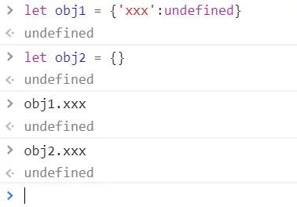

# JS对象的基本用法

## 1.声明对象的两种语法

```
let obj = new Object({'name':'bobo','age':18}) //比较正规的写法
let obj = {'name':'bobo','age':18} //比较书面的写法,常用这个
复制代码
```

## 2.如何删除对象的属性

```
delete obj.xxx`或者`delete obj['xxx']
```

但是要注意区分的是，删除属性是对象中将属性名删除，不是将对象中的属性其对应的值变为undefined。

判断是否对象中含有指定属性的方法`'属性名' in obj`

- 不含属性名`'xxx' in obj === false`
- 含有属性值，但值为undefined`'xxx' in obj && obj.xxx === undefined`
- 由此可见`obj.xxx === undefined`不能用来断定'xxx'是否为obj的属性





## 3.如何查看对象的属性

1. 查看**自身**所有属性:`Object.keys(obj)`
2. 查看**自身**的所有**属性的值**:`Object.values(obj)`
3. 查看**自身**的**属性**和**值**:`Object.entries(obj)`
4. 查看自身+共有属性:`console.dir(obj)`或者自己依次用`Object.keys`打印出`obj.__proto__`
5. 判断一个属性是自身的还是共有的:`obj.hasOwnProperty('toString')`

## 4.如何修改或增加对象的属性

1. 直接赋值:`obj.key='xxx' // key是字符串`
2. 批量赋值:`Object.assign(obj,{age:18,gender:'man'})`
3. 改共有属性:`Object.prototype['toString'] = 'xxx'`
4. 更改原型:`let obj = Object.create(objx) //原型改成objx`
5. 注意，所有的__proto__的代码都极其不推荐写

## 5.'name' in obj 与 obj.hasOwnProperty('name')的区别？

前者是判断对象**自身属性**里面是否有名为`name`的属性，不会在共有属性（原型对象）里面找。

后者是判断对象**自身**和**共有属性**里面是否有名为`name`的属性。