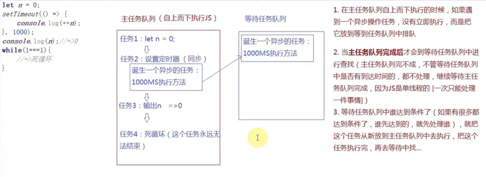
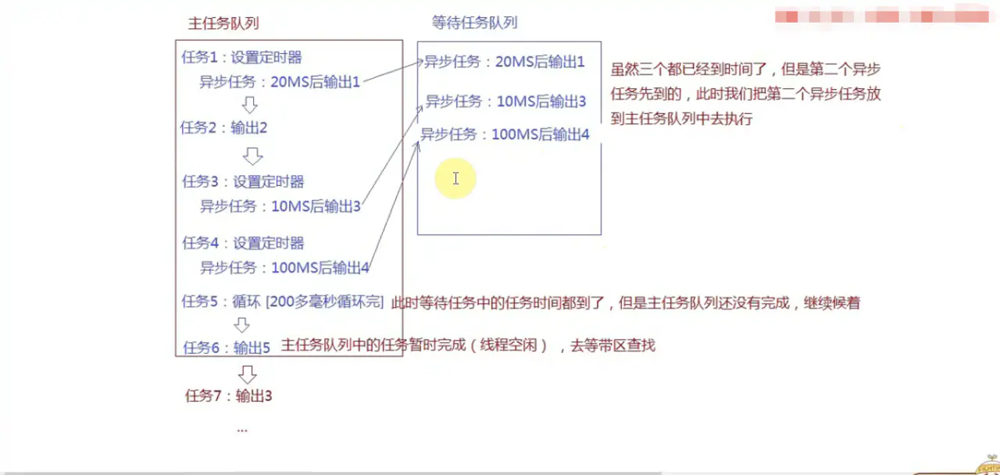
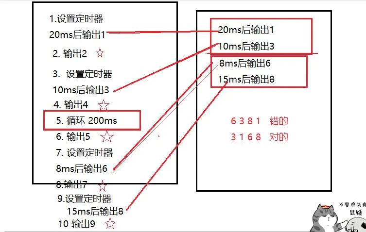

# JS笔记(20): JS中的同步编程和异步编程

## 铺垫：关于定时器

定时器：设定一个定时器，并且设定了等到的时间，当到达指定的时间，浏览器会把对应的方法执行

### 1）常用的定时器

- 1.`setTimeout(function,intarval)` 执行一次
- 2.`setInterval(function,intarval)` 可执行多次
- `function`: 到达时间后执行的方法（设置定时器的时候方法没有执行，到达时间后浏览器帮我们执行）
- `interval`: 时间因子（需要等待的时间 ms）

### 2）清除定时器

- `clearInterval / clearTimeout`

  这两个方法中的任何一个都可以清除用任何方法创建的定时器

- 1.设置定时器会有一个返回值，这个值是一个数字，属于定时器的编号，代表当前是第几个定时器（不管`setTimeout`还是`etInterval`创建定时器，这个编号会累加）

- 2.`clearInterval(编号) / clearTimeout(编号)`

  根据序号清除浏览器中设定的定时器

```
// 执行一次
let count = 0;
setTimeout(()=>{
    count++;
    console.log(count)
},1000)
复制代码
 // 轮循定时器：每间隔interval这么长时间，都会把设定的方法重新执行一次，直到定时器被清除
let count = 0;
let timer1 = setInterval(()=>{
    count++;
    console.log(count)
    if(count === 5){
        // 清除定时器
        clearInterval(timer1)
    }
},1000);

let timer2 = setInterval(()=>{},1000);
复制代码
```

## 一、JS中的同步编程和异步编程：

- 同步编程：任务是按照顺序依次处理，当前这件事没有彻底做完，下一件事不能执行
- 异步编程：当前这件事没有彻底做完，需要等待一段时间才能继续处理，此时我们不等，继续执行下面的任务，当后面任务完成后，再去把没有彻底完成的事情完成

## 二、JS中的异步编程：

- 1.所有的事件绑定都是异步编程
  - `xxx.onclick = function(){}`
- 2.所有定时器都是异步编程
  - `setTimeout(function(){},1000)`
- 3.AJAX中一般都使用异步编程处理
- 4.回调函数也算是异步编程

## 三、浏览器是如何规划同步异步机制？

- 1.浏览器是多线程的，JS是单线程的（浏览器只给JS执行分配一个线程）
  - 单线程的特点：一次只能处理一件事情

#### 进程与线程

每一个应用程序都可以理解为一个**进程**（浏览器打开一个页面，就相当于开辟一个进程），在一个程序中（进程中），经常会同时处理多个事情，此时需要分配多个**线程**区同时完成多项任务

- 2.浏览器在单线程当中实现异步的机制，主要依赖于任务队列完成的，浏览器中有两个任务队列：主任务队列 & 等待任务队列

```
let n = 0;
setTimeout(()=>{
    console.log(++n); //=> 第二次输出：过1s输出1
},1000)
console.log(n); //=> 第一次输出：0
复制代码
```





```
// 定时器设定一个时间，到达时间后不一定执行（如果当前还有其他同步任务正在处理，那么到时间也得等着）
let n = 0;
setTimeout(()=>{
    console.log(++n); 
},1000)
console.log(n); //=> 0
while(1===1){
    // 死循环
}
复制代码
```

#### 测试程序反映时间

```
let startTime = new Date();
console.time('AA')
for (let i = 0; i < 900000000; i++) {

}
console.timeEnd('AA') //200多ms
复制代码
```

## 执行题

#### 题1

```
 // 练习1
setTimeout(()=>{
    console.log(1); 
},20);
console.log(2); 
setTimeout(()=>{
    console.log(3); 
},10);
setTimeout(()=>{
    console.log(4); 
},100);
for (let i = 0; i <90000000; i++) {

}
console.log(5);
// 2 5 3 1 4
复制代码
```





#### 题2

```
// 练习2
let n = 0;
setTimeout(()=>{
    console.log(++n);
},0); // 定时器时间因子设置为0也不是立即执行，每一个浏览器都有一个自己最小的等待和反应时间（谷歌：5-6 IE:10-13)，所以写0还是异步编程
console.log(n)
// 0 1
复制代码
```

#### 题3

```
 setTimeout(() => {
    console.log(1);
}, 20);
console.log(2);
setTimeout(() => {
    console.log(3);
}, 10);
console.log(4);
for (let i = 0; i < 90000000; i++) {
    // 此循环大概200ms
}
console.log(5);
setTimeout(() => {
    console.log(6);
}, 8);
console.log(7);
setTimeout(() => {
    console.log(8);
}, 15);
console.log(9);
// 2 4 5 7 9 3 1 6 8 
// 因为中间有200ms的阻塞，所以在等待队列里，先输出阻塞前的 3 1 200ms结束后，输出阻塞后的 6 8 
复制代码
```




