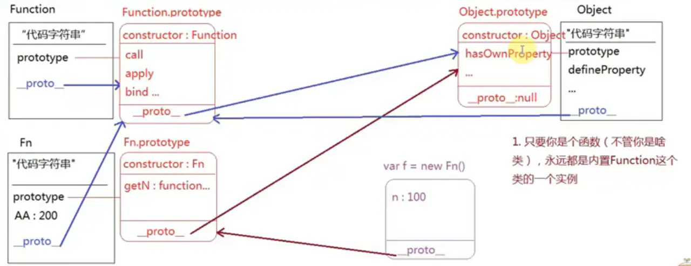

# JS笔记(7): 原型和原型链

### 一、面向对象编程

- 面向对象编程

  ```
  Object Oriented Programmimg
  ```

  ：把具有相同特征的事务抽象出一个类，把描述这个类的属性和方法挂在这个类的原型（prototype）上，这种方式叫做面向对象编程

  - 构造函数模式 + 原型模式 = js面向对象模式

- 对象：万物皆对象 对象封装了一些属性和方法用来描述一个事物或者供我们调用

- 类：对象的具体细分（按照功能特点进行分类：大类、小类）

  - 内置类：Object / Array / Date / RegExp / Function

- 实例：类中具体的一个事物（拿出类别中的具体一个实例进行研究，那么当前类别下的其他实例也具备这些特点和特征）

  - new xxx()

### 二、原型{`prototype`)：

- 1.所有的函数数据类型都有一个`prototype`的属性，它的属性值是一个对象，浏览器会为他开辟一个堆内存
- 2.在浏览器给prototype开辟的堆内存中有一个自带的属性：`constructor`,这个属性存储的是当前函数本身
- 3.所有的对象都有一个__proto__的属性，这个属性指向当前所属类的prototype（如果不能确定它是谁的实例，就是基类Object的实例）

### 三、原型链(`__proto__`)：

- 它是一种基于`__proto__`的向上查找机制。当我们操作实例上的某个属性或者方法的时候，首先会在自己空间中查找私有属性或方法
- 找到则查找结束，用私有属性即可；如果没查到，则基于`__proto__`找所属类（即构造函数）的prototype，如果有则用此公有属性，如果没有，继续基于原型上的`__proto__`向上查找，一直找到基类Object的prototype为止
- 如果`Object.prototype`上没有此属性，则此属性或方法不存在
- 只要是函数，不管是什么类，永远都是内置Function类的实例
- 构造函数的原型下的方法只给它的实例化对象使用





### 原型链执行题：

##### 题目一：

```
  function Fn(name, age) {
    let n = '哈哈';
    this.name = name;
    this.age = age;
    this.AA = function(){
        console.log(1)
    }
};
Fn.prototype.m = function () {
    console.log(2);
};
Fn.prototype.AA = function(){
    console.log(3);
}
Object.prototype.m = function () {
    console.log(4);
};
Function.prototype.m = function(){
    console.log(5)
}
let f1 = new Fn('Tom','18');
let f2 = new Fn('Jerry','18');

// console.log(f1.n); //undefined
console.log(Fn.prototype.m()); //2 ud
console.log(new Fn().m()); //2
console.log(f1.m()); //2

console.log(f1.m() === Fn.prototype.m()); //true
console.log(typeof Fn.prototype); // 'object'
console.log(f1 === f2); // false
console.log(f1.__proto__.AA === f2.__proto__.AA); // true

console.log(f1.__proto__.AA === Fn.prototype.AA); // true 
console.log(f1.hasOwnProperty === Fn.prototype.hasOwnProperty); //true
f1.BB = '123'; // 给自己设置私有属性 
f1.__proto__.CC = '456';// 给原型上设置公有属性（每个实例都可以用这个属性）<=> Fn.prototype.name = '123'
console.log(f1.BB);//123
console.log(f1.CC);//456
复制代码
```

##### 题目二：

```
function Fn(){
    var n = 10;
    this.name = '珠峰';
    this.age = 12;
    console.log(this); //实例 {name:'珠峰',age:12}
};
Function.prototype.n = function(){
    console.log(123);
};
var fn = new Fn();
console.log(fn); // 实例 {name:'珠峰',age:12}
console.dir(Fn); // Fn函数本身
console.log(fn.n); // f(){console.log(123)}
console.log(Fn.n); // 123 undefined
console.log(Fn.n()); // 123 undefined
console.log(fn.name); //'珠峰'
console.log(fn.age); // '12'
console.log(fn.constructor); //Fn(){...}
console.log(fn.__proto__); //{constructor: ƒ}
console.log(Fn.prototype); //{constructor: ƒ}
console.log(fn instanceof Fn); //true
console.log(fn instanceof Object); //true
console.log(fn instanceof Function); //flase
console.log('n' in fn); //flase
console.log('n' in Fn); //true n在Fn的原型(Function.prototype.n)上 
console.log('name' in fn); //true
console.log('name' in Fn); //true Fn有一个自带的属性name
console.log('age' in Fn); //false
console.log('constructor' in Fn); //true
console.log('toString' in Fn); //true toString是在基类Object上的公有属性
console.log(fn.hasOwnProperty('name')); //true
console.log(fn.hasOwnProperty('age'));//true
console.log(fn.hasOwnProperty('n')); //false
console.log(fn.hasOwnProperty('toString')); //false

function hasPubProperty(attr,obj){
    return (attr in obj) && (obj.hasOwnProperty(attr) === false)
};
console.log(hasPubProperty('toString',fn)); //true
复制代码
```

##### 题目三：

```
 function Foo(name, age) {
    this.name = name;
    this.printName = function () {
        console.log('haha', this.name);
    }
}
Foo.prototype.alertName = function () {
    alert(this.name)
}
Foo.prototype.printName = function () {
    console.log('hihi', this.name);
}
var f = new Foo('zhangsan'); 
f.printName = function () {
    console.log('hehe', this.name);
}
f.printName(); // hehe,zhangsan
f.alertName(); // 弹出 zhangsan
复制代码
```

##### 题目四：

```
var fullname = 'John Doe';
var obj = {
    fullname: 'Colin Ihrig',
    prop: {
        fullname: 'Aurelio De Rosa',
        getFullname: function () {
            return this.fullname;
        }
    }
};
console.log(obj.prop.getFullname()); // Aurelio De Rosa
var test = obj.prop.getFullname;
console.log(test());//全局 John Doe
复制代码
```

##### 题目五：

```
 function Person(name) {
    this.name = name;
}
Person.prototype.share = [];
Person.prototype.printName = function () {
    alert(this.name);
}
var person1 = new Person('Byron');
var person2 = new Person('Frank');
person1.share.push(1); // [1]
person2.share.push(2); // [1,2]
console.log(person2.share); // [1,2] 
复制代码
```

##### 题目六：

```
 function foo() {
    this.add = function (x, y) {
        return x + y;
    }
}
foo.prototype.add = function (x, y) {
    return x + y + 10;
}
Object.prototype.minus = function (x, y) {
    return x - y;
}
var f = new foo();
console.log(f.add(1, 2));//3
console.log(f.minus(1, 2));//-1
复制代码
```

##### 题目七：

```
function A() {
}
function B(a) {
    this.a = a;
}
function C(a) {
    if (a) {
        this.a = a;
    }
}
A.prototype.a = 1;
B.prototype.a = 1;
C.prototype.a = 1;
console.log(new A().a); // 1
console.log(new B().a); //undefined
console.log(new C(2).a); //2
复制代码
```

##### 题目八：

```
 function Fn() {
    this.x = 100;
    this.y = 200;
    this.getX = function () {
        console.log(this.x); // 100
    }
}
Fn.prototype.getX = function () {
    console.log(this.x); // undefined
};
Fn.prototype.getY = function () {
    console.log(this.y); // 200 undeined
};
var f1 = new Fn;
var f2 = new Fn;
console.log(f1.getX === f2.getX); //false 分别开辟私有作用域 是各自的私有属性
console.log(f1.getY === f2.getY); //true 是所属类prototype上的公有属性
console.log(f1.__proto__.getY === Fn.prototype.getY); //true
console.log(f1.__proto__.getX === f2.getX); // false 
console.log(f1.__proto__.getX === Fn.prototype.getX); //true
console.log(f1.constructor); //Fn(){...}
console.log(Fn.prototype.__proto__.constructor); // Object(){...}
f1.getX();
f1.__proto__.getX();
f2.getY();
Fn.prototype.getY();
复制代码
```

##### 题目九：

```
function Fn(name){
    this.name = name;
    let name = 20;
}    
Fn.prototype.say = function(){
    console.log(5);
}
Function.prototype.say = function(){
    alert(8);
}
Function.say = function(){
    alert(9);
}
Function.__proto__.say = function(){
    alert(10);
}    
let oo = new Fn;
oo.__proto__.say = function(){
    console.log(6);
}
oo.__proto__.__proto__.say = function(){
    console.log(7);
}
oo.say(); //6 
// 自身Fn里没有say属性，到所属类的原型上找，Fn.prototype.say 等价于 oo.__proto__.say 即console.log(6)

复制代码
```

##### 题目十：

```
 function fn() {
    return function(){
        console.log(3);
    }
}
fn.prototype.say = function () {
    console.log(2);
}
Function.prototype.say = function () {
    console.log(4);
}
fn.say = function () {
    console.log(1);
};
new fn().say(); //4  new fn() 
// 返回值是一个匿名函数，匿名函数.say() 即找匿名函数所属类的原型，即Function.prototype.say
new fn.say(); // 1 先看 fn.say 再看new fn.say  即new function(){console.log(1);}
```