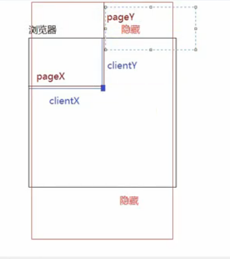
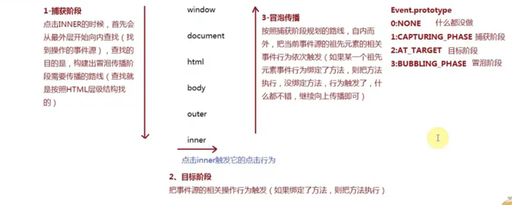
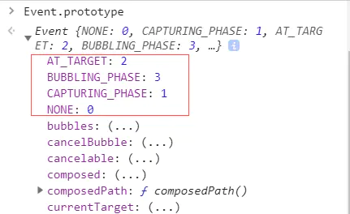
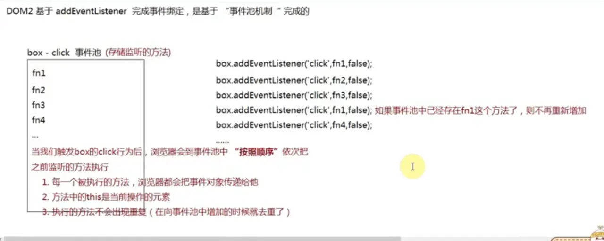
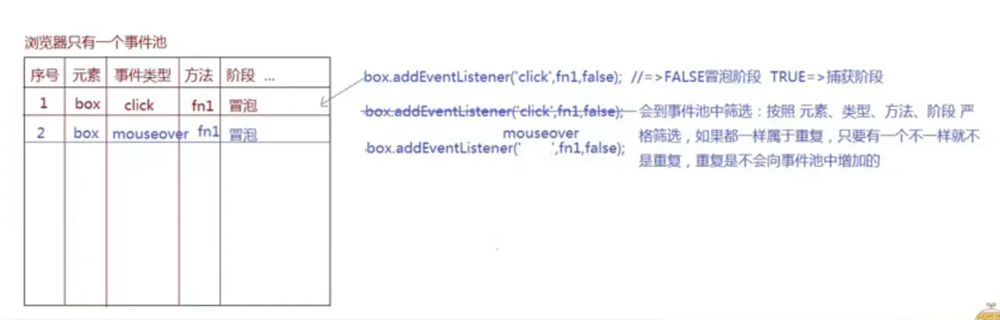
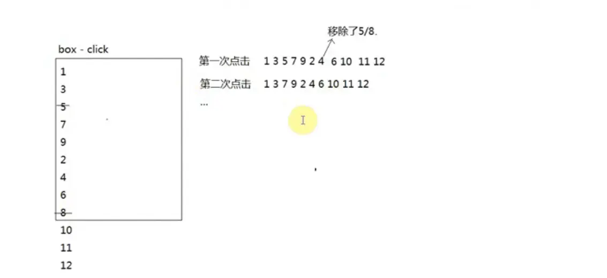

# JS笔记(17)：事件

## 一、事件的种类

- 事件：一件事情或者一种行为（对于元素来说，他的很多事件都是天生自带的），只要我们去操作这个元素，就会触发这些行为
  - 如果没有事件函数赋值，事件默认值为null
  - 系统默认事件：null
  - 自定义事件：undefined

### 元素天生自带的事件(事件本身不带on）：

#### 1) 【鼠标事件】

- `click`: 点击（PC端是点击，移动端的click代表单击[移动端使用click会有300ms的延迟]）
- `dblclick`: 双击
- `mouseover`: 鼠标经过
- `mouseout`：鼠标移出
- `mouseenter`：鼠标进入(没有冒泡)
- `mouseleave`：鼠标离开(没有冒泡)
- `mousemove`：鼠标移动
- `mousedown`：鼠标按下（鼠标左右键都起作用，按下即触发，click是按下抬起才触发，而且先把down和up触发，才触发click）
- `mouseup`：鼠标抬起
- `mousewheel`：鼠标滚轮滚动
- `contextmetu`：右键上下文菜单

#### 2) 【键盘事件】

- `keydown`：键盘按下（获取不到最新的value值，只能获取到上一个）
- `keyup`：键盘抬起（可以获取到新的value值）
- `keypress`：键盘长按（一般不用），和`keydown`类似，但`keydown`返回的是键盘码，`keypress`返回的是ASCII码
- `input`：移动端的内容改变事件。由于PC端有物理键盘，可以监听到键盘的按下和抬起，但是移动端时虚拟键盘，所以`keydown`和`keyup`在大部分手机上都没有，所以使用`input`事件统一代替他们

#### 3) 【表单元素常用的事件】

- `input`：当`<input>`、`<select>`、`<textarea>`的值发生变化时触发

```
// input事件
<textarea id="txt"></textarea>
<span id="span">0字</span>
// js部分
txt.addEventListener('input',function(ev){
    span.innerHTML = txt.value.length + '字'
})
复制代码
```

- `focus`：获取焦点
- `blur`：失去焦点
- `select`：在`<input>`、`<textarea>`里面选中文本时触发。（也有聚焦的功能）

```
// focus事件 select事件
<input type="text" id="txt1"/>
<button id="btn">选中代码</button>

//js部分
 txt1.addEventListener('focus',function(){
    console.log(1)
})
// txt1.focus(); //打开页面自动聚焦
btn.onclick = function(){
    txt1.select()
}
复制代码
```

- change：事件当`<input>`、`<select>`、`<textarea>`的值发生变化时触发。
  - 它与input事件的最大不同，就是不会连续触发，只有当全部修改完成时才会触发，另一方面input事件必然伴随change事件。
  - 具体来说，分成以下几种情况:
    - A. 激活单选框（radio）或复选框（checkbox）时触发。
    - B. 用户提交时触发。比如，从下列列表（select）完成选择，在日期或文件输入框完成选择。
    - C. 当文本框或`<textarea>`元素的值发生改变，并且丧失焦点时触发。

```
// change事件
 <select name="" id="sele">
    <option>哈哈</option>
    <option>呵呵</option>
    <option>嘿嘿</option>
    <option>嘻嘻</option>
</select>
<div id="div">哈哈</div>

//js部分
sele.onchange = function(){
    console.log(this.value);
    div.innerHTML = this.value;
}
复制代码
```

#### 4)【其他常用事件】

- `load`：加载完成

- `unload`：在窗口关闭或者document对象将要卸载时触发

- `beforeunload`:事件在窗口、文档、各种资源将要卸载前触发。它可以用来防止用户不小心卸载资源

- `scroll`：滚动条滚动事件（页面必须要有滚动条）

- ```
  mousewheel
  ```

  ：滚动条滚动事件(只要鼠标滚轮就触发)

  - ```
    ev.wheelDelta
    ```

    : 可以检测滚动的方向

    - 180 上滚轮
    - -180 下滚轮

- ```
  DOMMouseScroll
  ```

  : 火狐浏览器的滚轮滚动事件（只支持DOM2）

  - ```
    ev.detail
    ```

    : 检测滚动的方向

    - -3 上滚轮
    - 3 下滚轮

- `resize`：大小改变事件 window.onresize = function(){} 当浏览器窗口大小发生改变，会触发这个事件

- `error`：事件是在页面或资源加载失败时触发

- `hashchange`：事件在 URL 的 hash 部分（即#号后面的部分，包括#号）发生变化时触发

#### 5) 【移动端手指事件】

[单手指操作：touch]

- `touchstart`：手指按下
- `touchmove`：手指移动
- `touchend`：手指离开
- `touchcancel`：因为意外情况导致手指操作取消 [多手指操作：gesture]
- `gesturestart`：多手指按下
- `gesturechange`：手指改变
- `gestureend`：手指离开

#### 6) 【H5中audio/video音视频事件】

- `canplay`：可以播放（播放过程中可能出现由于资源没有加载完成导致的卡顿）
- `canplaythrough`：资源加载完成，可以正常无障碍播放

### 7) 【网页状态事件】

- `DOMContentLoaded`: DOM加载完成才触发的事件(高版本支持)

- ```
  readystatechange
  ```

  : DOM加载完成才触发的事件(DOM加载完成才触发的事件)

  - 在低版本IE下，`document`有个`doScroll`的方法 `document.documentElement.doScroll('left')`

    这个方法在DOM没有加载出来之前是没有的，也就是说 调用该方法会报错，换句话来说，只要DOM记载成功 就有doScroll方法

```
try{
    document.documentElement.doScroll('left')
    console.log('DOM加载完成');
}catch(e){
    再次调用try、catch直到进try
}
复制代码
/*
    在try中包裹可能会报错的代码，包裹之后不会影响下面代码执行
    只要捕获到错误，那么会进catch
*/

// let a = 5;
try{
    console.log(a);
}catch(error){
    a = 10;
    console.log(error);//字符串
}
alert(a);
复制代码
```

可自主扩展其他事件

## 二、事件绑定

- 事件绑定： 给元素天生自带的事件行为绑定方法，当事件触发，会把对应的方法执行

### 【DOM0级事件绑定】

- `element.onxxx = function(){}`
- 解除事件：ele.事件 = null

### 【DOM2级事件绑定】

- `element.addEventListener('xxx', function(){}, false);`

- 该方法接受三个参数。

  - 第一个参数：事件名称，大小写敏感。
  - 第二个参数：监听函数。事件发生时，会调用该监听函数。
  - 第三个参数：布尔值，表示监听函数是否在捕获阶段（capture）触发，默认为false（监听函数只在冒泡阶段被触发）。该参数可选。

- 移除事件的监听函数:

   

  ```
  ele.removeEventListener('click', listener, false);
  ```

  - 注意：`listener`参数如果为 `fn.bind(this)`,则不能移除，因为`bind`会改变函数地址

### 事件绑定的目的：

给当前元素的某个事件绑定方法（不管是基于DOM0还是DOM2），都是为了触发元素的相关行为的时候，能把绑定的方法执行，不仅把方法执行，而且浏览器还给方法传递了一个实参信息 ===>事件对象

## 三、事件对象：

### 事件对象的种类

- `MouseEvent` 鼠标事件对象
- `KeyboardEvent` 键盘事件对象
- `Event` 普通事件对象
- `TouchEvent` 手指事件对象

### 事件对象的目的：

- 事件对象中记录了很多属性名和属性值，这些信息中心包含了当前操作的基础信息，例如：
  - 鼠标点击位置的X/Y轴坐标
  - 鼠标点击的是谁（事件源）

### 事件对象中常用的属性：

#### 1) 【`MouseEvent`:鼠标事件对象中的属性】

- `ev.target`: 事件源（操作的是哪个元素）,在嵌套关系中，给上层元素绑定事件，可以通过事件源，查到事件触发的对象（元素）
- `ev.target.tagName`: 'LI' 查看标签名（大写）
- `ev.clientX` / `ev.clientY`: 当前鼠标触发点距离当前窗口可视区左上角的X/Y轴坐标





- `ev.pageX`/`ev.pageY`: 当前鼠标触发点距离body（第一屏幕）左上角X/Y轴坐标
  - 相当于 `pageXOffset + event.clientX` (元素到body左边的距离+元素本身宽度)
  - 相当于 `pageYOffset + event.clientY` (元素到body顶部的距离+元素本身高度)
- `ev.preventDefault()`: 阻止默认行为
- `ev.stopPropagation()`: 阻止事件的冒泡传播(低版本浏览器不兼容)
- `ev.cnacelBubble = true`: 阻止事件的冒泡传播(chrome/IE: window中都有一个event对象，火狐中没有event对象)
- `ev.type`: 当前事件类型

#### 2) 【`KeyboardEvent`: 键盘事件对象中的属性】

- `ev.keycode`: 当前按键的键盘码(数字类型) 13
- `v.ctrlKey`: 布尔值
- `ev.shiftKey`: 布尔值
- `ev.altKey`: 布尔值 [常用的键盘码]
- 左-上-右-下： 37 38 39 40
- Backspace: 8
- Enter: 13
- Space: 32
- Delete: 46
- Shift: 16
- Alt: 18
- Ctrl: 17
- F1-F12: 112-123
- 0-9: 48-57
- 小写字母: 65-90

```
// MouseEvent 鼠标事件对象
box.onclick = function(ev){
    //定义一个形参ev用来接收方法执行的时候，浏览器传递的信息值（事件对象）
    console.log(ev); 
    //MouseEvent {isTrusted: true, screenX: 52, screenY: 161, clientX: 52, clientY: 58, …}
}
复制代码
// KeyboardEvent 键盘事件对象
box.onkeydown = function(ev){
    console.log(ev); 
}
input.onkeydown = function(ev){
    console.log(ev); //KeyboardEvent {isTrusted: true, key: "Enter", code: "Enter", location: 0, ctrlKey: false, …}
}
复制代码
// Event 普通事件对象
window.onload = function(ev){
    console.log(ev); //Event {isTrusted: true, type: "load", target: document, currentTarget: Window, eventPhase: 2, …}
}
复制代码
```

#### 键盘事件小例子

结构和样式

```
<input type="text" id="txt">
<ul id="ul"></ul>
复制代码
let ul = document.getElementById('ul')
txt.addEventListener('keyup',function(ev){
    console.log(ev);
    // 同时按住ctrl键和enter键 就把input输入框中输入的内容插入到已有li元素的前面
    if(ev.keyCode === 13 && ev.ctrlKey){
        ul.insertAdjacentHTML('afterbegin',`<li>${this.value}</li>`)
    }
})
复制代码
```

#### 关于mouseenter和mouseover的区别：

- `mouseover`: 鼠标经过
- `mouseout`：鼠标移出
- `mouseenter`：鼠标进入(阻止冒泡传播)
- `mouseleave`：鼠标离开(阻止冒泡传播) 真实项目中多用 `mouseenter`/`mouseleave`

结构和样式

```
 <style>
    #outer {
        position: absolute;
        top: 30px;
        left: 30px;
        width: 500px;
        height: 500px;
        background: red;
        cursor: pointer;
    }
    #inner {
        position: absolute;
        top: 30px;
        left: 30px;
        width: 150px;
        height: 150px;
        background: #fff;
        cursor: pointer;
    }
</style>
复制代码
<div id="outer">
    <div id="inner"></div>
</div>
复制代码
// 用onmouseover / onmouseout 
inner.onmouseover = function () {
    console.log('进入白盒子')
}
inner.onmouseout = function () {
    console.log('离开白盒子')
}
outer.onmouseover = function () {
    console.log('进入红盒子')
}
outer.onmouseout = function () {
    console.log('离开红盒子')
}
复制代码
// 用onmouseenter / onmouseleave
inner.onmouseenter = function () {
    console.log('进入白盒子')
}
inner.onmouseleave = function () {
    console.log('离开白盒子')
}
outer.onmouseenter = function () {
    console.log('进入红盒子')
}
outer.onmouseleave = function () {
    console.log('离开红盒子')
}
复制代码
```

## 四、事件的默认行为

### 事件的默认行为：

事件本身就是天生就有的，某些事件触发，即使没有绑定方法，也会存在一些效果，这些默认的效果就是**事件的默认行为**

#### A. 例如：a标签的点击操作就存在默认行为

- 1.页面跳转
  - `<a href="http://www.baidu.com" target="_blank"><a/>`
- 2.描点定位（hash定位）
  - `<a href="#box" target="_blank"><a/>`
  - 首先会在当前页面URL地址栏末尾设置一个`hash`值，浏览器检测到hash值后，会默认定位到当前页面中id和hash相同的盒子的位置（基于hash值实现spa单页面应用）

#### B. 例如：input标签的默认行为：

- 1.输入内容可以呈现到文本框当中
- 2.输入内容时，会把之前输入的一些信息呈现出来（并不是所有浏览器和所有情况都有）

#### C. 例如：submit标签的默认行为：

在`form`当中设置`anction`，点击`submit`，会默认按照`anction`的地址进行页面跳转，并且把表单中的信息传递进去（非前后端分离项目中，有服务器进行页面渲染，由其他语言实现数据交互）

```
<form action="https://www.baidu.com/">
<input type="submit" value="提交"/>
</form>
复制代码
```

## 五、阻止事件的默认行为

### A. 阻止a标签的默认行为

很多时候我们使用a标签仅仅是想做一个普通的按钮，点击实现一个功能，不想页面跳转，也不想锚点定位

- 1. 在结构中阻止：

  <a href="javascript:void 0/undefined/null/false;">珠峰最新视频</a>

- 1. 在JS中阻止:

给其click事件绑定方法，当我们点击a标签，先触发click事件，其次才会执行自己的默认行为

- 1. `ev.returnValue = false;` （支持DOM0和DOM2，可以设置布尔值来控制是否阻止默认行为）
- 1. `return false;` （只支持DOM0）
- 1. `ev.preventDefault();` （DOM2常用）

如果想阻止某部分元素的默认行为，在指定元素下阻止即可；如果在document上阻止默认行为，那么整个文档中的默认行为都会被阻止

```
 // 阻止a标签的默认行为
link.onclick = function(ev){
    ev = ev || window.event;
    // return false;
    ev.preventDefault ? ev.preventDefault():ev.returnValue = false;
}
复制代码
```

### B. 阻止input标签的默认行为

```
// 阻止input标签的默认行为，即不能输入内容 

// DOM0
input1.onkeydown = function(ev){
    // ev = ev || window.event;
    ev.preventDefault() ? ev.preventDefault() : ev.returnValue = false;
    // return false;
}

// DOM2
input1.addEventListener('keydown',function(ev){
    ev.preventDefault();
})
复制代码
```

### C. 阻止contectmenu的默认行为

```
// 阻止右键菜单的默认行为
document.addEventListener('contextmenu',function(ev){
    ev.preventDefault()
})
复制代码
```

## 六、事件的传播机制

### 1) 事件的传播机制：（事件流/事件模型机制)

- 冒泡传播：

触发当前元素的某一个事件（比如点击事件）行为，不仅当前元素事件行为触发，而且其祖先元素的相关事件行为也会被依次触发，这种机制就是事件的传播机制

- 这种传播分成三个阶段。
  - 第一阶段：从`window`对象传导到目标节点（上层传到底层），称为“捕获阶段”（capture phase）。
  - 第二阶段：在目标节点上触发，称为“目标阶段”（target phase）。
  - 第三阶段：从目标节点传导回`window`对象（从底层传回上层），称为“冒泡阶段”（bubbling phase）。

这三个阶段的传播模型，使得同一个事件会在多个节点上触发








### 2) DOM0级事件与DOM2级事件绑定方式

- `xxx.onxxx = function(){};`

  - `DOM0`级事件绑定方式，只有冒泡阶段。如果事件绑定的是目标元素，就按照目标事件的先后顺序依次绑定

- `xxx.addEventListener('xxx',function(){},false);`

  第三个参数：

  - 为false：是控制绑定的方法在事件传播的冒泡阶段（或者目标阶段）执行；
  - 为true：代表让当前方法在事件传播的捕获阶段触发执行（这种捕获阶段

### 3) 事件对象的一些理解：

- 1.事件对象是用来存储当前本次操作的相关信息的，和操作有关，和元素无必然关联。
- 2.当我们基于鼠标或者键盘等操作的时候，浏览器会把本次操作的信息存储起来（标准浏览器存储到默认的内存当中（自己找不到），IE低版本存储到`window.event`中），存储的值是一个对象（堆内存）；操作会触发元素的某个行为，把绑定的方法执行，此时标准浏览器会把之前存储的对象（内存地址）当做实参传递给每一个执行的方法，所以操作一次，即使再多方法中都有`ev`，但是存储的值都是一个（本次操作的信息对象）

### 4) 事件的传播机制代码演示

公共样式：

```
<style>
#outer {
    position: absolute;
    top: 30px;
    left: 30px;
    width: 500px;
    height: 500px;
    background: red;
    cursor: pointer;
}

#center {
    position: absolute;
    top: 30px;
    left: 30px;
    width: 300px;
    height: 300px;
    background: pink;
    cursor: pointer;
}

#inner {
    position: absolute;
    top: 30px;
    left: 30px;
    width: 150px;
    height: 150px;
    background: #fff;
    cursor: pointer;
}
</style>

复制代码
<div id="outer">
    <div id="center">
        <div id="inner">
            <button id="btn">按钮</button>
        </div>
    </div>
</div>
复制代码
let aa = null;
window.onclick = function(ev){
    console.log(ev === aa); //true
    alert('window')
}
outer.onclick = function(ev){
    console.log(ev === aa); //true
    alert('红盒子')
}
center.onclick = function(ev){
    console.log(ev === aa); //true
    alert('粉盒子')
}
inner.onclick = function(ev){

    aa = ev;
    alert('白盒子')
}
btn.onclick = function(ev){
    ev = ev || window.event;
    ev.stopPropagation()?ev.stopPropagation():ev.cancelBubble = true;
    // 阻止冒泡传播 ev.stopPropagation()低版本不兼容  ev.cancelBubble = true 所有浏览器都兼容
    alert('按钮')
}
复制代码
```

### 5） 事件的传播机制练习题

```
//结构和样式同上
function fn() { alert('btn1'); }
btn.addEventListener('click', fn, true);
outer.addEventListener('click',function(){alert('red');});
btn.addEventListener('click', fn, true);
inner.addEventListener('click', function () { alert('yellow'); }, true);
center.addEventListener('click', function () { alert('green'); });
btn.addEventListener('click', function () { alert('btn捕获'); }, true);
btn.addEventListener('click', function () { alert('btn冒泡'); });
btn.addEventListener('click', fn, false);
// 答案：yellow btn1 btn捕获 btn冒泡 btn1 green red
复制代码
```

## 七。事件委托（事件代理）

- 事件委托（事件代理）：

利用事件冒泡传播机制，如果一个容器的后代元素当中，很多元素的点击行为（其他事件行为也是）都要做一些处理，此时我们不需要再像以前一样一个个获取一个个绑定，只需要给容器的click绑定方法即可，这样不管点击的是哪一个后代元素，都会根据冒泡传播机制把容器的click行为触发，把绑定的方法执行，根据事件源我们可以知道点击的是谁，从而做不同的事情即可

- `ev.target`: 事件源（操作的是哪个元素）,在嵌套关系中，给上层元素绑定事件，可以通过事件源，查到事件触发的对象（元素）
  - `tagName: 'LI'` 查看标签名（大写）


事件委托这种处理方式比一个个的事件绑定，性能上提高50%左右，而且需要操作的元素越多，性能提高越大

公共样式：

```
<style>
ul {
    margin: 0 auto;
    width: 100px;
    border: 2px solid fuchsia;
}

li {
    width: 50px;
    height: 50px;
    border: 1px solid #000;
}
</style>
复制代码
 <ul id="ul">
    <li></li>
    <li></li>
    <li></li>
    <li></li>
    <li></li>
    <li></li>
    <li></li>
</ul>
复制代码
 // 给所有li的上级元素ul绑定点击事件，则其所有后代元素都会执行这个方法
ul.addEventListener('click',function(ev){
   ev.target.style.background = 'green'
})
复制代码
// 点击一个变色，点击下一个变色，同时上一个取消变色
let lis = document.querySelectorAll('#ul>li')
ul.onclick = function (ev) {
    // console.log(ev.target.tagName); // 'LI'
    // ev.target.tagName 即当前点击的标签的标签名（大写）
    if (ev.target.tagName === 'LI') {
        for (let i = 0; i < lis.length; i++) {
            // 循环所有的li元素，如果当前循环的li元素不等于当前点击的li元素，就把当前循环的li元素的背景颜色清空，如果当前循环的li元素等于当前点击的元素，就把当前点击的li元素加上颜色
            if (lis[i] !== ev.target) {
                lis[i].style.background = '';
            } else {
                ev.target.style.background = 'green';
            }
        }
    }
}
复制代码
```

## 八、DOM0和DOM2的运行机制

### `DOM0: element.onxxx = function(){}`

每一个元素对象都是对应类的实例，浏览器天生为其设置了很多私有属性和公有的属性方法，而`onclick`就是其中的一个私有属性（事件类似私有属性，还有很多其他的事件私有属性），这些属性默认值是`null`

- DOM0事件绑定原理：
  - 就是给元素的某一个事件私有属性赋值（浏览器会建立监听机制，当我们触发元素的某个行为，浏览器会自己把属性中赋的值去执行）

### DOM2的事件池机制:

- `element.addEventListener('xxx', function(){}, false);`
- 移除事件的监听函数: `ele.removeEventListener('click', listener, false);`
- 使用的方法都是`EventTarget.prototype`上定义的
- DOM2事件池： 当我们触发box的click行为后，浏览器会到事件池中“按照顺序”依次把之前监听的方法执行
  - 1.每一个被执行的方法，浏览器都会把事件对象传递给他
  - 2.方法中的this是当前操作的元素
  - 3.执行的方法不会出现重复，在向事件池增加的时候就去重了
- 完整事件池机制：
  - DOM2事件绑定可以给当前元素的某一个行为绑定“多个不同的方法”







### DOM0和DOM2事件绑定的区别：

- 1.机制不一样
  - DOM0采用的是给私有属性赋值，所以只能绑定一个方法，DOM2采用的是事件池机制，所以能绑定多个不同的方法
- 2.关于移除的操作
  - DOM0移除，将事件赋值为null即可，不需要考虑绑定的是谁
  - DOM2移除，必须清楚要移除的是哪一个方法，才能在事件池当中移除掉。所以基于DOM2做事件绑定，要有“瞻前顾后”的思路，也就是绑定的时候要考虑一下如何移除（不要绑定匿名函数）
- 3.DOM2事件绑定中增加了一些DOM0无法操作的事件行为；例如：`DOMContentLoaded`事件（当页面中的页面中HTML结构加载完成就会触发执行）

```
// DOM0事件绑定：只允许给当前元素的某个事件行为绑定一个方法，多次绑定，后面绑定的内容会替换前面绑定的，以最后一次绑定的方法为主
box.onclick = function(){
    console.log(1)
}  
box.onclick = function(){
    console.log(2);// 触发点击行为，只输出2
}  
复制代码
// DOM2事件绑定
function fn1(){console.log(1)}
function fn2(){console.log(2)}
function fn3(){console.log(3)}
function fn4(ev){
    console.log(4,this === box,ev.target)
    box.removeEventListener('click',fn5);
    box.removeEventListener('click',fn8);
}
function fn5(){console.log(5)}
function fn6(){console.log(6)}
function fn7(){console.log(7)}
function fn8(){console.log(8)}
function fn9(){console.log(9)}
function fn10(){console.log(10)}

box.addEventListener('click',fn1);
box.addEventListener('click',fn3);
box.addEventListener('click',fn5);
box.addEventListener('click',fn7);
box.addEventListener('click',fn9);
box.addEventListener('click',fn2);
box.addEventListener('click',fn2);//重复
box.addEventListener('click',fn2);//重复
box.addEventListener('mouseenter',fn2); //增加到事件池当中的
box.addEventListener('click',fn4);
box.addEventListener('click',fn6);
box.addEventListener('click',fn8);
box.addEventListener('click',fn10);
复制代码
```

在上个例子中：

首先在事件未执行前，会把box的click的所有方法添加到一个数组里面(即添加到事件池里面），此时数组中有[fn1,fn3,fn5,fn7,fn9,fn2,fn4,fn6,fn8,fn10]

当第一次点击box，会依次输出1,3,5,7,9,2,4(此时移除了数组中的fn5和fn8方法),6,10

当第二次点击box，会依次输出1,3,7,9,2,4,6,10





```
let fn = function(){ }
box.addEventListener('DOMContentLoaded',fn); //可以
box.onDOMContentLoaded = fn; //不可以，box没有这个属性
复制代码
```

## 九、鼠标跟随

结构和样式

```
<style>
#box {
    width: 100px;
    height: 100px;
    position: absolute;
    top: 0;
    left: 0;
    background: red;
}
body{
    height: 3000px;
}
</style>
复制代码
 <div id="box"></div>
复制代码
```

js代码

```
document.onmousemove = function (ev) {
    // console.log(ev.clientX);
    // console.log(ev.clientY);
    // 实现鼠标在盒子中间：ev.pageX: 鼠标离窗口左边的距离 - 盒子宽度的一半 此时left：盒子左边到浏览器左边的距离
    let left = ev.pageX - box.clientWidth / 2;
    let top = ev.pageY - box.clientHeight / 2;

    if (left < 0) {
        left = 0;
    } 
    if (left > document.documentElement.clientWidth - box.clientWidth) {
        // document.documentElement.clientWidth - box.clientWidth 即盒子距离窗口左边的最大距离（超过此最大距离，盒子就会溢出窗口）
        // 盒子到浏览器左边的距离 > 最大距离，就让盒子到浏览器左边的距离 = 最大距离
        left = document.documentElement.clientWidth - box.clientWidth;
    }

    if (top < 0) { 
        top = 0;
    } else if (top > document.documentElement.clientHeight - box.clientHeight) {
        top = document.documentElement.clientHeight - box.clientHeight;
    }
    //让盒子距窗口左边/顶部的距离 = 鼠标离窗口左边/顶部的距离
    box.style.left = left + 'px';
    box.style.top = top + 'px';
}
复制代码
```

## 十、推箱子

结构和样式

```
<style>
    #box {
        width: 100px;
        height: 100px;
        position: absolute;
        top: 0;
        left: 0;
        background: red;
    }
</style>
复制代码
<div id="box"></div>
复制代码
```

js代码

```
 num1 = 0;
num2 = 0
let timer = null;
document.addEventListener('keydown', function move(ev) {
    clearInterval(timer);
    timer = setInterval(() => {
        switch (ev.keyCode) {
            case 39:
                num1 += 10;
                // box.style.left = num1 + 'px';
                break;
            case 40:
                num2 += 10;
                // box.style.top = num2 + 'px';
                break;
            case 37:
                num1 -= 10;
                // box.style.left = num1 + 'px';
                break;
            case 38:
                num2 -= 10;
                // box.style.top = num2 + 'px';
                break;
        }
        num1 < 0 ? num1 = 0 : null;
        box.style.left = num1 + 'px';
        num2 < 0 ? num2 = 0 : null;
        box.style.top = num2 + 'px';
    }, 22)
});
document.addEventListener('keyup',function(){
    clearInterval(timer)
})
```