# JS笔记(18): 盒子模型属性

## 一、client系列

- `clientWidth & clientHeight`: 获取当前元素可视区的宽高（内容的宽高+左右/上下padding）
- `clientTop & clientLeft`: 获取上/左边框的宽度

内容和是否有溢出无关（和是否设置了overflow: hidden无关，就是我们自己及设定的内容的宽高padding


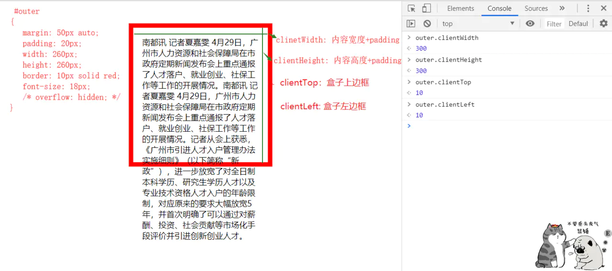


## 二、offset系列

- `offsetWidth & offsetHeight`: 内容的宽高+左右/上下padding+左右/上下border（和内容是否溢出无关）


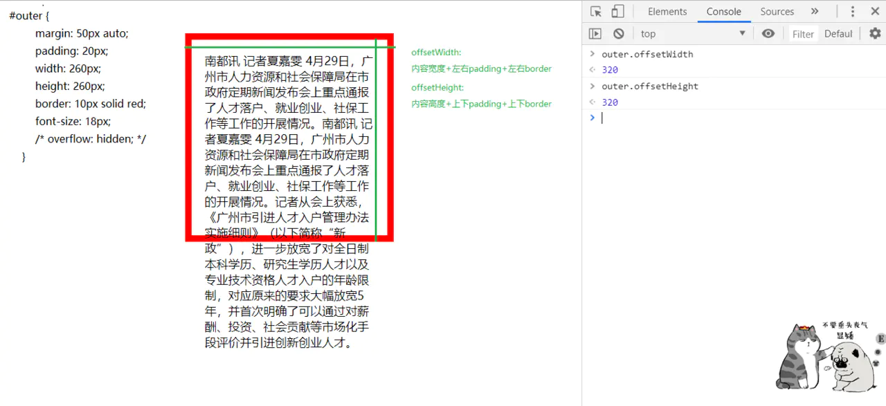


- `offsetParent`: 当前盒子的父级参照物
  - 参照物：同一个平面当中，元素的父级参照物和结构没有必然联系，默认他们的父级参照物都是body（当前平面最外层的盒子）
  - body的父级参照物为null
- `offsetTop/offsetLeft`:
  - 获取当前盒子距离其父级参照物的偏移量（上偏移/左偏移）
  - 当前盒子的外边框开始 - 父级参照物的内边框

图示：


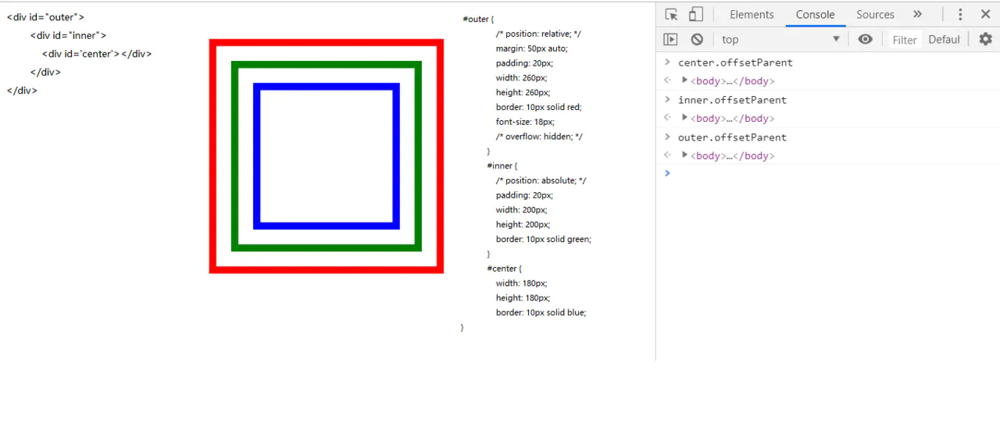


- 例如上面结构中：

outer.offsetParent //=>body

inner.offsetParent //=>body

center.offsetParent //=>body

- 参照物可以改变：
  - 构建出不同的平面即可（使用`zIndex`，但是这个属性只对定位有作用），所以改变元素的定位（`position:relative/absolute/fixed`),可以改变其父级参照物
- 例如上面结构中，

如果给`outer`设置`position:relative`之后(把`outer`脱离原有的平面，独立出一个新的平面，后代元素的父级参照物都会以他为参考)


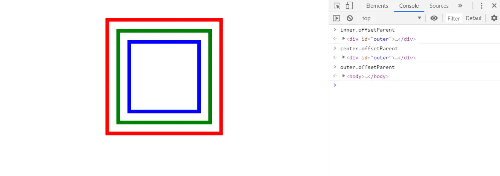


inner.offsetParent //=>outer

center.offsetParent //=>outer

outer.offsetParent //=> body

- 上面结构中：

如果给`inner`设置`position:absolute`之后


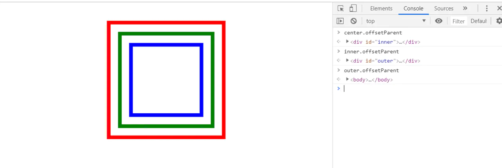


center.offsetParent //=>inner

inner.offsetParent //=>outer

outer.offsetParent //=>body

#### 获取当前元素距离body的偏移量

- 不管父级参照物是谁，都要获取当前元素距离body的偏移量（左偏移/上偏移）
- 不能改变既定的样式（不能基于position方式改变他的参照物）
- 任意元素距离body的偏移（不管参照物）
  - 1.首先获取当前元素的左偏移
  - 2.在这个基础上累加
    - A.父级参照物的边框
    - B.父级参照物的偏移
  - 累加完父级的，再找父级的父级(A)，加上A的左边框和左偏移，加到父级参照物是body为止


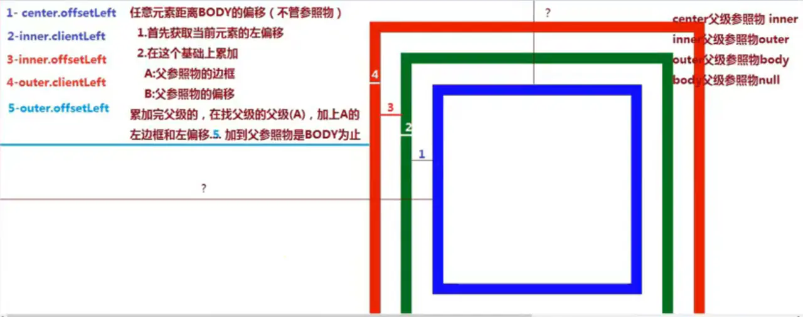


## 三、scroll系列

- ```
  scrollWidth & scrollHeight
  ```

  : 真实内容的宽高+左/上padding

  - 是一个约等于的值，在不同浏览器当中，或者是否设置`overflow: hidden`，都对结果有影响，所以这个值只做参考
  - 不一定是自己设定的值，因为可能会存在内容溢出，如果有内容溢出，需要把溢出的部分算上，如果没有内容溢出，和client一样
  - 获取当前页面的真实宽高，包含溢出部分

- ```
  scrollTop/scrollLeft
  ```

  : 滚动条卷曲的宽度/高度

  - 在JS盒子模型13个属性中，只有`scrollTop/scrollLeft`是可读可写属性，其余都是只读属性
  - 最小卷去值：0
  - 最大卷去值：真实页面的高度 - 一屏幕的高度 `document.documentElement.scrollHeight - document.documentElement.clientHeight`

## 四、获取元素样式值

#### 1) 通过JS盒模型属性获取值的特点:

- 1.获取的都是数字，不带单位
- 2.获取的都是整数，不会出现小数（一般都是四舍五入，尤其是获取的偏移量）
- 3.获取的结果都是复合样式值（好几个元素样式组合在一起的值），如果只想获取单一样式值，例如只想获得padding值，盒子模型属性无法操作

#### 2) 获取元素具体的某个样式值：

- 1.`元素.style.xxx` ：只能获取所有写在元素行内上的样式（不写在行内上，获取不到）
- 2.`window.getComputedStyle([元素],null)`

获取当前元素所有经过浏览器计算的样式：只要当样式前元素可以在页面中展现（或者浏览器渲染它了，那么他的样式都是被浏览器计算过的）

```
2.1 不管当前样式写在哪
2.2 不管当前样式写没写（浏览器会给元素设置一些默认样式）
复制代码
```

## 五、关于可视区的宽高

- 获取当前元素一屏内（可视区域）的宽度和高度
  - 宽： `document.documentElement.clientWidth || document.body.clientWidth`
  - 高： `document.documentElement.clientHeight || document.body.clientHeight`
  - 不算横向滚动条的高度，值是固定的
- 获取可视区的宽高（window对象）：只读属性
  - 宽：`window.innerWidth`
  - 高：`window.innerHeight`

### `document.documentElement.clientWidth` 与 `window.innerWidth`的区别图示


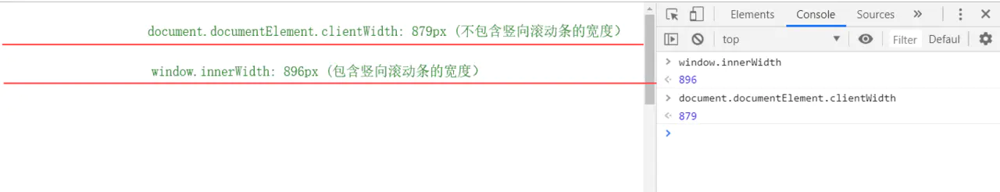


高度同理

## 六、关于滚动条的距离

- 获取当前页面的真实宽高，包含溢出部分
  - 宽：`document.documentElement.scrollWidth || document.body.scrollWidth`
  - 高：`document.documentElement.scrollHeight || document.body.scrollHeight`
  - 不算横向滚动条的高度，值是固定的，可读可写

图示： `document.documentElement.scrollHeight` 与 `document.documentElement.clientHeight`的区别


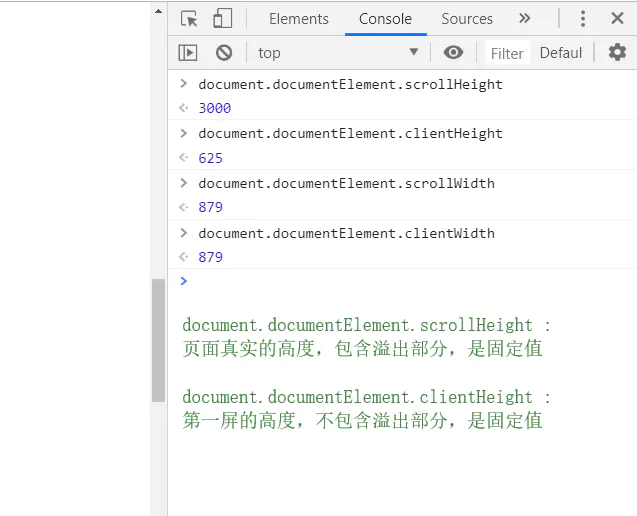


- 滚动条到顶部/左部的距离（值不固定，随滚动条滚动而变化，只读属性）
  - `window.pageXOffset`: 滚动条到左边的距离（X轴）
  - `window.pageYOffset`: 滚动条到顶部的距离（Y轴）
  - 在IE低版本下
    - `document.documentElement.scrollLeft` 滚动条到左边的距离（X轴）
    - `document.documentElement.scrollTop`滚动条到顶部的距离（Y轴）


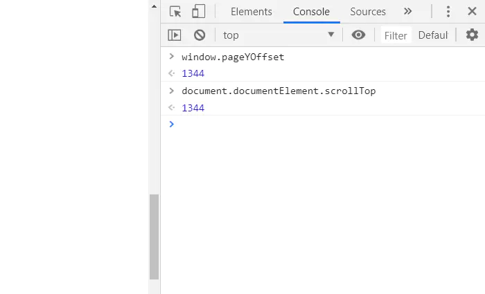


- 将文档滚动到指定位置
  - `window.scrollTo(x，y)`
  - 它接受两个参数，表示滚动后位于窗口左上角的页面坐标。
  - 此属性可写不可读

## 七、getBoundingClientRect()

`getBoundingClientRect()` : 获取元素到页面可视区的尺寸、距离

- 注意: 是跟滚动条走的
- x：元素左上角相对于视口的横坐标
- y：元素左上角相对于视口的纵坐标
- height：元素高度
- width：元素宽度
- left：元素左上角相对于视口的横坐标，与x属性相等
- right：元素右边界相对于视口的横坐标（等于x + width）
- top：元素顶部相对于视口的纵坐标，与y属性相等
- bottom：元素底部相对于视口的纵坐标（等于y + height）


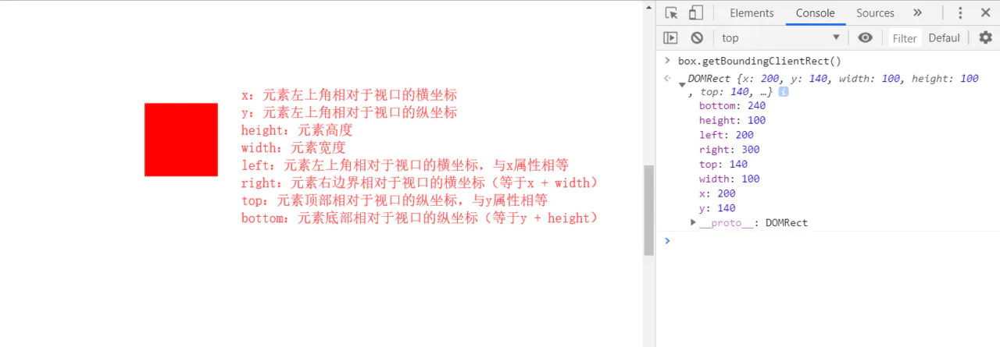


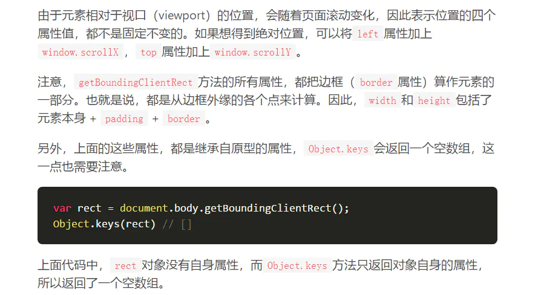