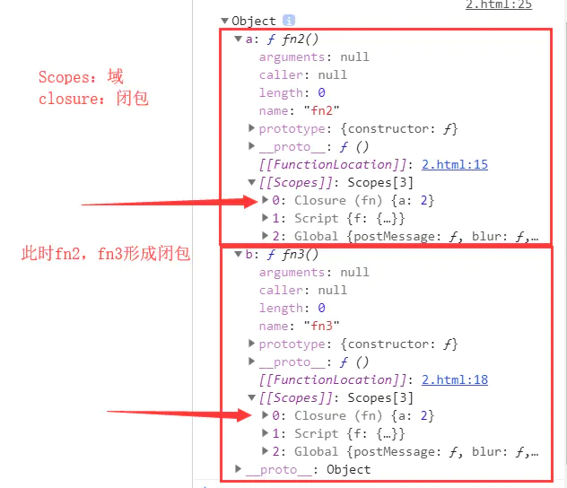

# JS笔记(5) 闭包初步理解

闭包:

- 函数套函数，子函数使用父函数的参数或者变量
- 并且子函数被外界所引用，此时父级形成闭包环境
- 父级的参数或者变量不被浏览器垃圾回收机制回收.
- 此时，打印父函数的返回值，有个属性为Scopes
- Scopes下有个closure的属性，closure 就是闭包。
- 使用闭包可以一直存储父级的参数或者变量
- 不被外界的函数或者变量所干扰（污染）

```
        function fn() {
            let a = 2;
            let obj = {
                a: function fn2() {
                    console.log(a);
                },
                b: function fn3() {
                    console.log(a);
                }
            };
            return obj;
        };
        let f = fn();
        console.dir(f);
复制代码
```


