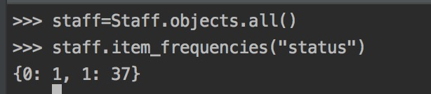

https://house.blog.csdn.net/article/details/106313080    CSDn  [宅神kin](https://house.blog.csdn.net/)  面试报告

### item_frequencies的使用

文档是这么写的:**返回整个查询文档集中字段存在的所有项的字典及其对应的频率**，即某字段所有值的集合(去重)和结果出现次数，简单来说就是group_by

**想到的应用场景**

1. 一个班级所有人的数学成绩，不及格的多少人，60-70的多少人，80-90的多少人…

2. 分类

   

**使用**:

