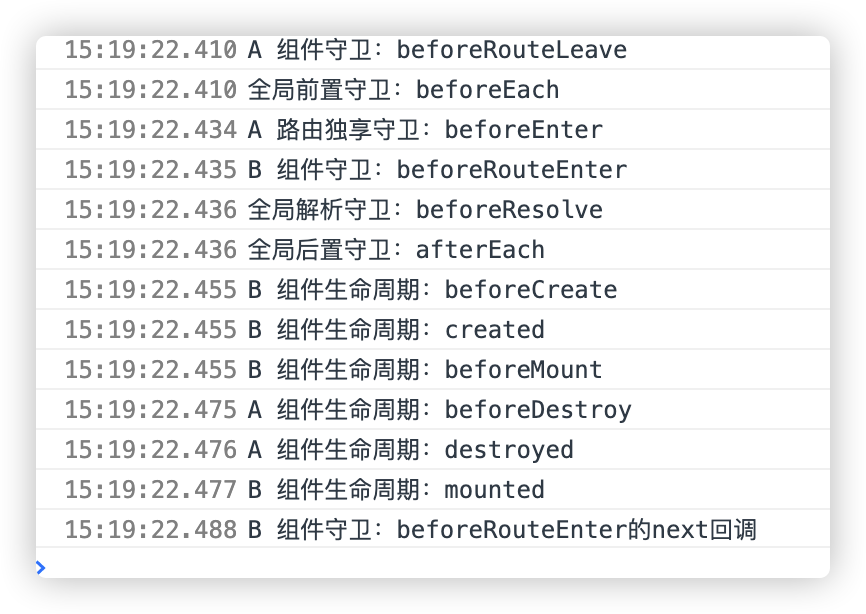

1. 导航被触发
2. 离开组件守卫 `beforeRouteLeave` （在失活的组件里调用）
3. 全局前置守卫: `beforeEach` 
4. 组件守卫 `beforeRouteUpdate`  (在重用的组件里调用)。
5. **独享路由守卫** `beforeEnter`（在路由配置里调用）。
6. 解析异步路由组件。
7. 组件守卫 `beforeRouteEnter`（在被激活的组件里调用）。
8. 全局解析守卫 `beforeResolve` 守卫 (2.5+)。
9. 导航被确认。
10. 全局后置守卫 `afterEach` 。
11. 触发 DOM 更新。
12. 组件生命周期beforeCreate
13. 组件生命周期created
14. 组件生命周期beforeMount
15. 离开组件生命周期beforeDestroy()。
16. 离开组件生命周期destroyed()
17. 组件生命周期mounted
18. 组件守卫`beforeRouteEnter` 的 `next` 的回调函数，创建好的组件实例会作为回调函数的参数传入。

vue的路由参数$route有更新时，没有离开组件

1.全局前置守卫：beforeEach

2.组件路由守卫 `beforeRouteUpdate` 守卫

3.全局解析守卫：：beforeResolve

4.全局后置守卫：：afterEach

5.watch的路由监听

离开组件时

组件守卫：beforeRouteLeave

vue的数据data有更新时

1.组件生命周期 beforeUpdate

2.组件生命周期 updated

例如 A路由跳转到B路由，顺序如下图

B路由参数改变时，组件复用时

