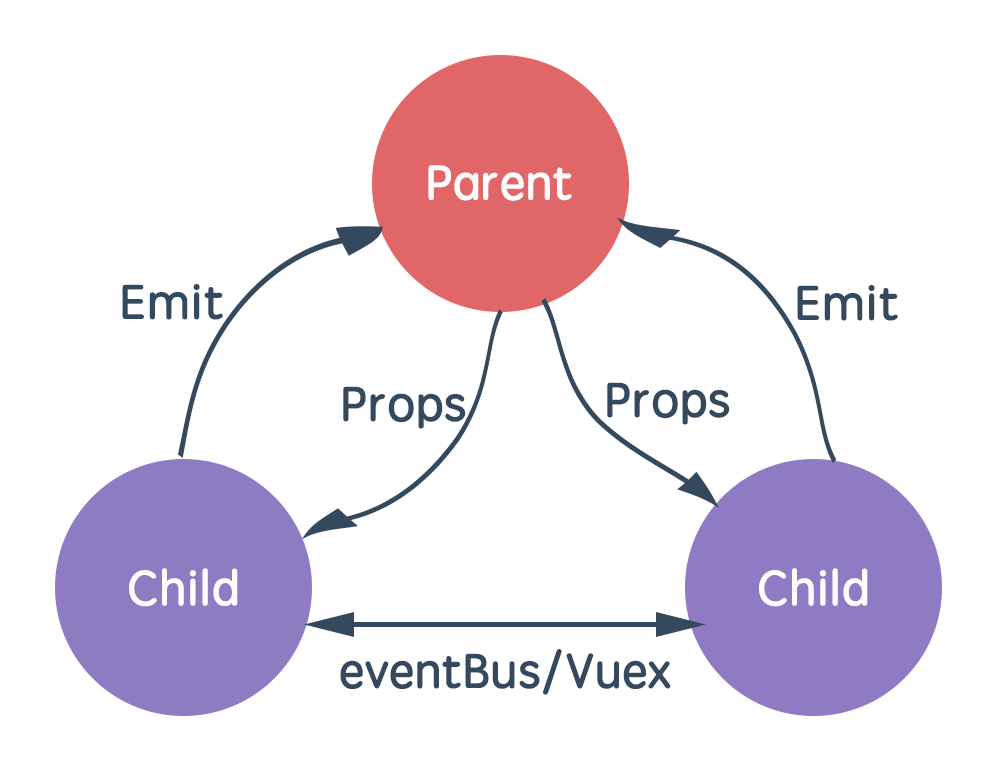

# `Vue props用法详解

[](https://www.jianshu.com/u/7524d9ad5181)

[myserendipit](https://www.jianshu.com/u/7524d9ad5181)关注

### 总结

可以想象一下项目中组件与组件的关系无外乎这么几种：父子，兄弟，祖孙（嵌套）。

1. 父子组件：父组件通过 props 向下传递子组件数据，子组件通过事件向上发送父组件消息。或者也可以通过 ref 属性、$parent、$children等方法获取数据和事件。
2. 兄弟组件：可以通过共同的父组件作为桥梁进行通讯，也可以利用全局事件 eventBus 或者比较复杂的 Vuex。

**一图胜千言**



遇到嵌套组件的情况，比如「组件A」包含「组件B」，「组件B」包含「组件C」。

那「组件A」与「组件C」如何通信就是值得我们商榷的问题，是利用 Vuex 还是利用其他方式呢？

首先 Vuex 是优秀的状态管理工具，对于复杂而又庞大的系统而言使用 Vuex 再好不过。

但如果我们的系统相对简单，并且「组件A」与「组件C」之间只是进行简单的数据传递，似乎引入 Vuex 并不是一个好的选择，相反会带来复杂度的上升。

 2 个属性「$attrs」与「$listeners」，使用它们进行嵌套组件（祖孙）的通信是一个不错的选择

1.$attrs：通过 v-bind="$attrs" 传入内部组件，内部组件this.$attrs访问

> 官方解释：包含了父作用域中不作为 prop 被识别 (且获取) 的特性绑定 (class 和 style 除外)。当一个组件没有声明任何 prop 时，这里会包含所有父作用域的绑定 (class 和 style 除外)，并且可以通过 v-bind="$attrs" 传入内部组件——在创建高级别的组件时非常有用。


2.$listeners：通过 v-on="$listeners" 传入内部组件，内部组件this.$listeners访问

> 包含了父作用域中的 (不含 .native 修饰器的) v-on 事件监听器。它可以通过 v-on="$listeners" 传入内部组件——在创建更高层次的组件时非常有用。

简单来说：$attrs 与 $listeners 是两个「对象」，$attrs 里存放的是父组件中绑定的非 Props 属性，$listeners里存放的是父组件中绑定的非原生事件。

使用步骤：ABC为嵌套组件

1.在A组件模板中B组件标签上写上非prop属性

2.在B组件模板中C组件标签上使用 v-bind="$attrs 或者 v-on="$listeners" 传入到C组件中

3.在C组件中使用 this.$attrs 或者 this.$listeners 就可以访问A组件的属性了

# Vue props用法详解

### 总结：

组件接受的选项之一 props 是 Vue 中非常重要的一个选项。父子组件的关系可以总结为：

**props down, events up**

**1.父组件通过 props 向下传递数据给子组件；子组件通过 events 给父组件发送消息。**

**2.props选项可以是一个字符串数组props:[]，也可以是一个对象props:{}。**

**3.字符串数组是自定义属性名的数组，当需要验证属性的值或设置默认值时，props必须是一个对象，键为属性名，值为属性值得类型或数组或对象**

4.prop 会在一个组件实例创建**之前**进行验证，所以实例的 property (如 `data`、`computed` 等) 在 `default` 或 `validator` 函数中是不可用的。

5.使用步骤

5.1在子组件定义props选项，用this.变量名访问

~~~js
props:['属性1','属性2']
props:{
  // 基础的类型检查 (`null` 和 `undefined` 会通过任何类型验证)
	属性1:String,
  // 多个可能的类型
	属性2:[String, Number],
  // 对象
  属性3:{
    // 1.检查类型
    // 值可以是下列原生构造函数中的一种：String、Number、Boolean、Array、Object、Date、Function、Symbol、任何自定义构造函数、或上述内容组成的数组。
    type:String,
    // 2.可设置默认值
    default:"我是默认值",
    // 2.1 对象或数组默认值必须从一个工厂函数获取
    default: function () {
      return { message: 'hello' }
    }
    // 3.可定义属性3是否为必填项
   	required: true,
    // 4.可自定义验证函数
    validator: function (value) {
        return value >= 0
      }
  }
}
~~~

5.2在父组件使用子组件时，用属性传入，

~~~php+HTML
<!-- 1.传入数字 -->
<child :test="45"></child>
<!-- 2.传入布尔值 -->
<child test></child>
<child :test="false"></child>
<!-- 3.传入数组 -->
<child :test="[1,2,3]"></child>
<!-- 4.传入对象 -->
<child :test="{jjj:55}"></child>
<!-- 5.传入多个属性 -->
<child v-bind="post"></child>
等价于
<child :test="[]" :test1="hahah"></child>

<script>
  
const post={
	test:[],
	test1:'hahah',
}

</script>

~~~


## 父子级组件

比如我们需要创建两个组件 parent 和 child。需要保证每个组件可以在相对隔离的环境中书写，这样也能提高组件的可维护性。

这里我们先定义父子两个组件和一个 Vue 对象：

```js
var childNode = {
  template: `
        <div>childNode</div>
        `
};
var parentNode = {
  template: `
        <div>
          <child></child>
          <child></child>
        </div>
        `,
  components: {
    child: childNode
  }
};
new Vue({
  el: "#example",
  components: {
    parent: parentNode
  }
});
```


```html
<div id="example">
  <parent></parent>
</div>
```

这里的 childNode 定义的 template 是一个 div，并且内容是"childNode"字符串。
而在 parentNode 的 template 中定义了 div 的 class 名叫 parent 并且包含了两个 child 组件。

## 静态 props

组件实例的作用域是孤立的。这意味着不能（也不应该）在子组件的模板中直接饮用父组件的数据。要让子组件使用父组件的数据，需要通过子组件的 props 选项。

父组件向子组件传递数据分为两种方式：动态和静态，这里先介绍静态方式。

子组件要显示的用 props 声明它期望获得的数据

修改上例中的代码，给 childNode 添加一个 props 选项和需要的`forChildMsg`数据;
然后在父组件中的占位符添加特性的方式来传递数据。


```js
var childNode = {
  template: `
        <div>
          {{forChildMsg}}
        </div>
        `,
  props: ["for-child-msg"]
};
var parentNode = {
  template: `
        <div>
          <p>parentNode</p>
          <child for-child-msg="aaa"></child>
          <child for-child-msg="bbb"></child>
        </div>
        `,
  components: {
    child: childNode
  }
};
```

**命名规范**
对于 props 声明的属性，在父组件的 template 模板中，属性名需要使用中划线写法；

子组件 props 属性声明时，使用小驼峰或者中划线写法都可以；而子组件的模板使用从父组件传来的变量时，需要使用对应的小驼峰写法。别担心，Vue 能够正确识别出小驼峰和下划线命名法混用的变量，如这里的`forChildMsg`和`for-child-msg`是同一值。

## 动态 props

在模板中，要动态地绑定父组件的数据到子组件模板的 props，和绑定 Html 标签特性一样，使用`v-bind`绑定；

基于上述静态 props 的代码，这次只需要改动父组件：


```js
var parentNode = {
  template: `
        <div>
          <p>parentNode</p>
          <child :for-child-msg="childMsg1"></child>
          <child :for-child-msg="childMsg2"></child>
        </div>
        `,
  components: {
    child: childNode
  },
  data: function() {
    return {
      childMsg1: "Dynamic props msg for child-1",
      childMsg2: "Dynamic props msg for child-2"
    };
  }
};
```

在父组件的 data 的 return 数据中的 childMsg1 和 childMsg2 会被传入子组件中，

## props 验证

验证传入的 props 参数的数据规格，如果不符合数据规格，Vue 会发出警告。

> 能判断的所有种类（也就是 type 值）有：
> String, Number, Boolean, Function, Object, Array, Symbol


```js
Vue.component("example", {
  props: {
    // 基础类型检测, null意味着任何类型都行
    propA: Number,
    // 多种类型
    propB: [String, Number],
    // 必传且是String
    propC: {
      type: String,
      required: true
    },
    // 数字有默认值
    propD: {
      type: Number,
      default: 101
    },
    // 对象、默认值是一个工厂函数返回对象
    propE: {
      type: Object,
      default: function() {
        console.log("propE default invoked.");
        return { message: "I am from propE." };
      }
    },
    // 自定义验证函数
    propF: {
      isValid: function(value) {
        return value > 100;
      }
    }
  }
});
let childNode = {
  template: "<div>{{forChildMsg}}</div>",
  props: {
    "for-child-msg": Number
  }
};
let parentNode = {
  template: `
          <div class="parent">
            <child :for-child-msg="msg"></child>
          </div>
        `,
  components: {
    child: childNode
  },
  data() {
    return {
      // 当这里是字符串 "123456"时会报错
      msg: 123456
    };
  }
};
```

还可以在 props 定义的数据中加入自定义验证函数，当函数返回 false 时，输出警告。

比如我们把上述例子中的 childNode 的`for-child-msg`修改成一个对象，并包含一个名叫`validator`的函数，该命名是规定叫`validator`的，自定义函数名不会生效。


```js
let childNode = {
  template: "<div>{{forChildMsg}}</div>",
  props: {
    "for-child-msg": {
      validator: function(value) {
        return value > 100;
      }
    }
  }
};
```

在这里我们给`for-child-msg`变量设置了`validator`函数，并且要求传入的值必须大于 100，否则报出警告。

## 单向数据流

props 是单向绑定的：当父组件的属性变化时，将传导给子组件，但是不会反过来。这是为了防止子组件五一修改父组件的状态。

所以不应该在子组件中修改 props 中的值，Vue 会报出警告。


```js
let childNode = {
  template: `
          <div class="child">
            <div>
              <span>子组件数据</span>
              <input v-model="forChildMsg"/>
            </div>
            <p>{{forChildMsg}}</p>
          </div>`,
  props: {
    "for-child-msg": String
  }
};
let parentNode = {
  template: `
          <div class="parent">
            <div>
              <span>父组件数据</span>
              <input v-model="msg"/>
            </div>
            <p>{{msg}}</p>
            <child :for-child-msg="msg"></child>
          </div>
        `,
  components: {
    child: childNode
  },
  data() {
    return {
      msg: "default string."
    };
  }
};
```

这里我们给父组件和子组件都有一个输入框，并且显示出父组件数据和子组件的数据。当我们在父组件的输入框输入新数据时，同步的子组件数据也被修改了；这就是 props 的向子组件传递数据。而当我们修改子组件的输入框时，浏览器的控制台则报出错误警告

> [Vue warn]: Avoid mutating a prop directly since the value will be overwritten whenever the parent component re-renders. Instead, use a data or computed property based on the prop's value. Prop being mutated: "forChildMsg"

## 修改 props 数据

通常有两种原因：

1. prop 作为初始值传入后，子组件想把它当做局部数据来用
2. prop 作为初始值传入后，由子组件处理成其他数据输出

应对办法是

1. 定义一个局部变量，并用 prop 的值初始化它

但是由于定义的 ownChildMsg 只能接受 forChildMsg 的初始值，当父组件要传递的值变化发生时，ownChildMsg 无法收到更新。


```js
let childNode = {
  template: `
          <div class="child">
            <div>
              <span>子组件数据</span>
              <input v-model="forChildMsg"/>
            </div>
            <p>{{forChildMsg}}</p>
            <p>ownChildMsg : {{ownChildMsg}}</p>
          </div>`,
  props: {
    "for-child-msg": String
  },
  data() {
    return { ownChildMsg: this.forChildMsg };
  }
};
```

这里我们加了一个<p>用于查看 ownChildMsg 数据是否变化，结果发现只有默认值传递给了 ownChildMsg，父组件改变只会变化到 forChildMsg，不会修改 ownChildMsg。

1. 定义一个计算属性，处理 prop 的值并返回

由于是计算属性，所以只能显示值，不能设置值。我们这里设置的是一旦从父组件修改了 forChildMsg 数据，我们就把 forChildMsg 加上一个字符串"---ownChildMsg"，然后显示在屏幕上。这时是可以每当父组件修改了新数据，都会更新 ownChildMsg 数据的。


```js
let childNode = {
  template: `
          <div class="child">
            <div>
              <span>子组件数据</span>
              <input v-model="forChildMsg"/>
            </div>
            <p>{{forChildMsg}}</p>
            <p>ownChildMsg : {{ownChildMsg}}</p>
          </div>`,
  props: {
    "for-child-msg": String
  },
  computed: {
    ownChildMsg() {
      return this.forChildMsg + "---ownChildMsg";
    }
  }
};
```

2. 更加妥帖的方式是使用变量存储 prop 的初始值，并用 watch 来观察 prop 值得变化。发生变化时，更新变量的值。


```js
let childNode = {
  template: `
          <div class="child">
            <div>
              <span>子组件数据</span>
              <input v-model="forChildMsg"/>
            </div>
            <p>{{forChildMsg}}</p>
            <p>ownChildMsg : {{ownChildMsg}}</p>
          </div>`,
  props: {
    "for-child-msg": String
  },
  data() {
    return {
      ownChildMsg: this.forChildMsg
    };
  },
  watch: {
    forChildMsg() {
      this.ownChildMsg = this.forChildMsg;
    }
  }
};
```