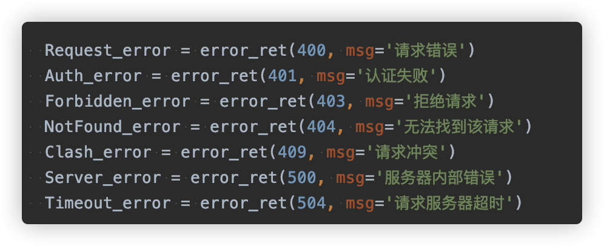

天眼后端状态码

时间、状态、内网IP、外网IP、网络流量、运行时间、CPU、内存

内网IP、外网IP、网关、外网、网卡、网络流量

~~~
// 获取redis慢查询统计
export function redisSlowStat(params) {
  return request({
    url: '/redis_slow/stat/',
    method: 'get',
    params,
  })
}

 <!-- 表格 -->
      <chart-line :option="slowOption" class="slow-chart" />
      
      import { parseTime } from '@/utils'
      import {
  redisQueryLog,
  redisSlowStat,
  setUpMinTime,
} from '@/api/project-manage/redis'
   slowOption: {},
   
   
    redisSlowStat({ id: this.hid, port: this.port }).then(res => {
          if (res.code === 200) {
            console.log(res.data)
            let slow_stats = res.data.slow_stats
            let option = {
              xAxis: {
                name: '时间',
                data: slow_stats.map(h =>
                  parseTime(h.t).replace(' ', '\n'),
                ),
              },
              legend: {
                type: 'scroll',
              },
              toolbox: {
                top: '15',
                right: '20',
              },
              grid: {
                top: '50',
                left: '55',
                right: '85',
                bottom: '40',
              },
            }

            this.slowOption = this.$_.merge(option, {
              legend: {
                data: ['慢查询数量'],
              },
              series: [
                {
                  name: '慢查询数量',
                  type: 'line',
                  data: slow_stats.map(h => h.c || 0),
                },
              ],
            })
          }
        })
        
        
         .slow-chart {
    height: 300px;
  }
}
~~~

post接口用get会报405还是400

post接口用param会报405还是400

https://www.staticfile.org/ echart升级链接

~~~
当前数据库信息
文档总数
数据库所有文档的总大小

connections当前连接和可用连接数
索引命中率
~~~

